# Roco N (and others) to Kato Track Adapters

Parametric OpenSCAD adapter beds for N-scale [Roco](https://www.roco.cc/) track to connect to the [Kato Unitrack](https://www.katomodels.com/unitrack) system.

The adapters are printed and glued to the underside of Roco track pieces, adding a Kato-compatible sleeper bed with Unijoiner connectors so the Roco pieces plug straight into any Kato Unitrack layout.

25 pre-built configurations are included, covering all common Roco straights, curves and turnouts. Custom pieces and multi-piece layout plates can be generated with a few lines of OpenSCAD.

In general, they should work with any bedless Code 80 system. (Roco N, Fleischmann, Minitrix, Peco, Atlas) From personal experience, I recommend not mixing Minitrix and Roco track on the same base, as the slight difference in height can cause trouble.

You can use the stl files of the pre-built models with any slicer. If you want to work with custom settings or do other modifications you will need OpenSCAD, and Python 3 for the export script.

Layer height should be 0.1mm or less.

---

## Pre-Built Models

Run `./export_stl.sh` to generate all STL files and preview images from the parameter sets in `Roco_Kato_Adapter.json`.

### Turnouts

| Model | Preview |
|---|:---:|
| **Roco Turnout L 2417** — left, 24°, R194.6, with drive platform | 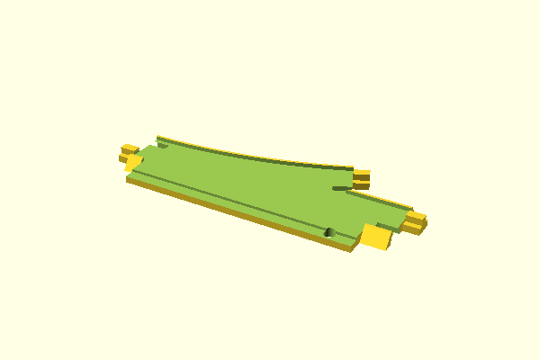 |
| **Roco Turnout L 2417 w/ Roco 2413 33.6mm straight** on turnout | 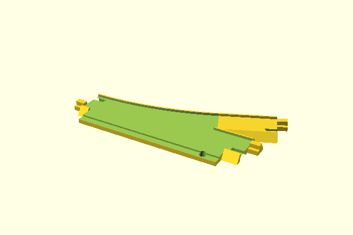 |
| **Roco Turnout L 2417 w/ Roco 2419 R1 6°** — with 6° curve appended | 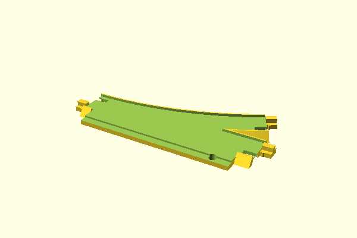 |
| **Roco Turnout L 2417 w/ Roco Curve 2420 R1 24°** — with 24° S-curve appended | 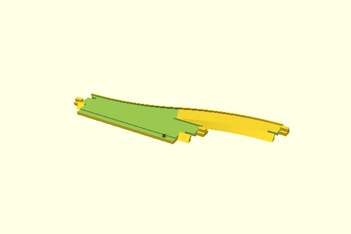 |
| **Roco Turnout R 2418** — right 24°, R194.6, with drive platform | 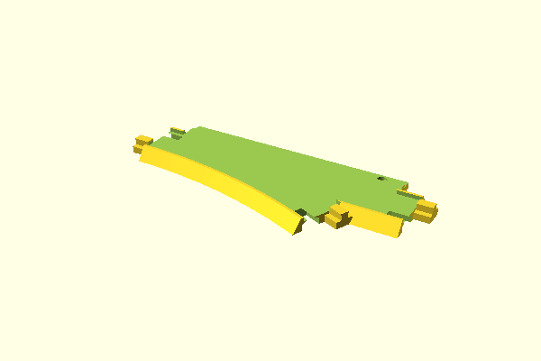 |
| **Roco Turnout R 2418 w/ Roco 2413 33.6mm straight** | 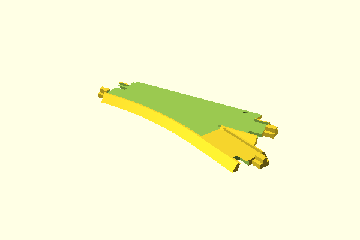 |
| **Roco Turnout R 2418 w/ Roco 2419 R1 6°** | 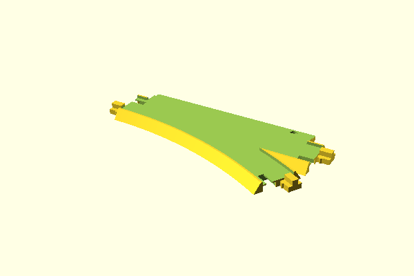 |

### Straights and Decoupler

| Model | Preview |
|---|:---:|
| **Roco Straight 2401** — 104.2 mm standard straight | 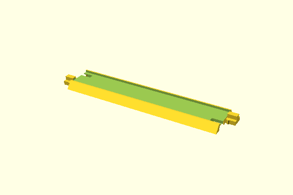 |
| **Roco Straight 2426** — 17.2 mm | 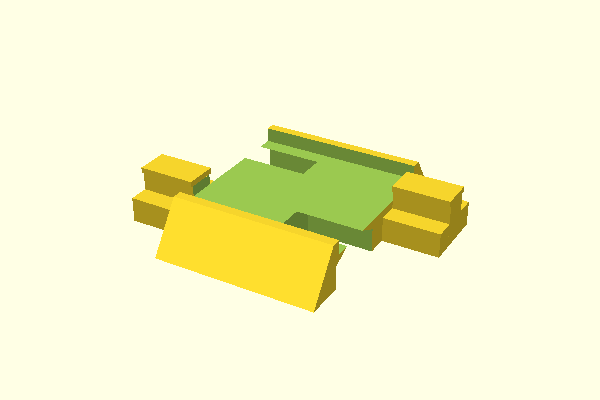 |
| **Roco Straight 2413** — 33.6 mm | 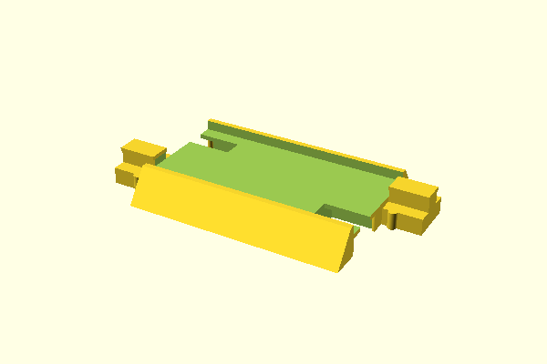 |
| **Roco Straight 2421** — 50.0 mm |  |
| **Roco Straight 2423** — 54.2 mm | 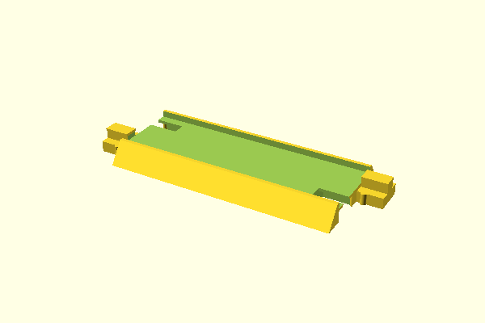 |
| **Roco Decoupler 2412** — 76.2 mm, with drive platform | 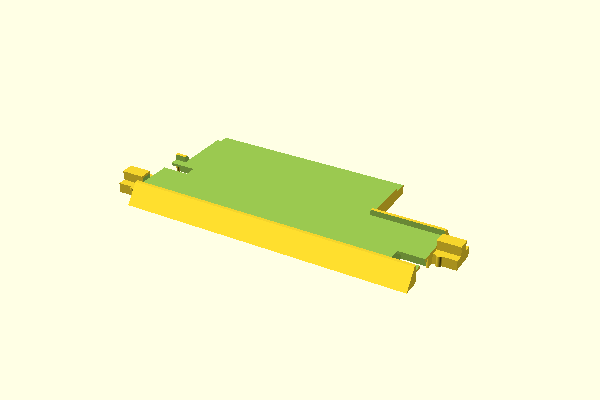 |

### Curves

| R1 (194.6 mm) | R2 (228.2 mm) | R3 / R3A / R4–R6 |
|:---:|:---:|:---:|
| 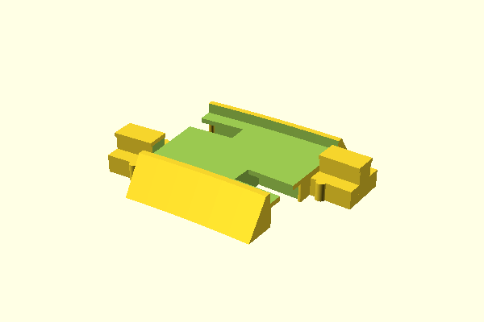<br>**2420 R1 6°** | 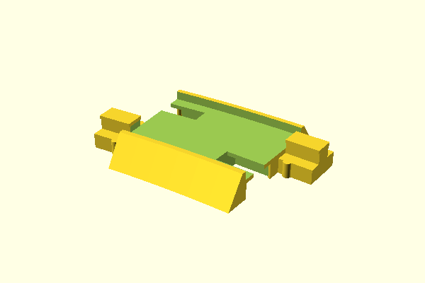<br>**2424 R2 6°** | 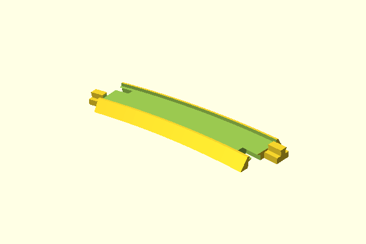<br>**2409S R3A 15°** |
| 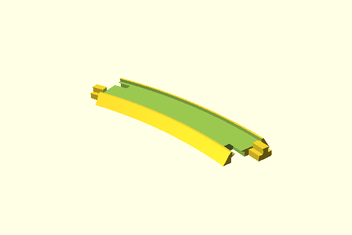<br>**2420 R1 24°** | <br>**2425 R2 24°** | <br>**2410S R3A 30°** |
| 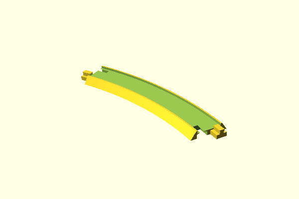<br>**2402 R1 30°** | 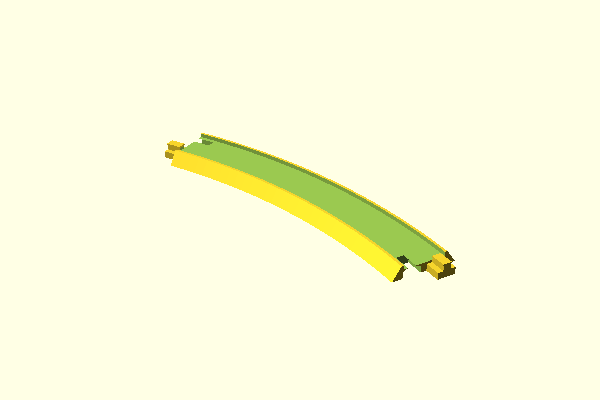<br>**2403 R2 30°** | 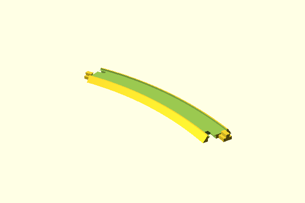<br>**2404 R3 30°** |
| | | 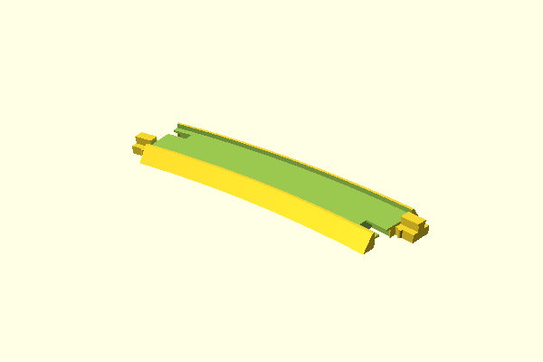<br>**2407 R4 15°** |
| | | 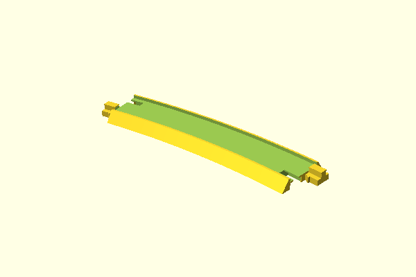<br>**2408 R5 15°** |
| | | 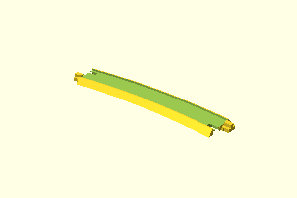<br>**2405 R6 15°** |

---

## Usage

### 1 — Print a Pre-Built Model

1. Run `./export_stl.sh` to generate all STL files into the `stl/` folder
   (also generates PNG previews into `img/` for reference).
2. Open the desired STL in desired Slicer and print.

Pre-built configurations are defined in `Roco_Kato_Adapter.json`. To use one directly in OpenSCAD:

```bash
openscad -o my_piece.stl -p Roco_Kato_Adapter.json -P "Roco Turnout L 2417" Roco_Kato_Adapter.scad
```

### 2 — Customise a Single Piece

Open `Roco_Kato_Adapter.scad` in OpenSCAD. The **Customizer** panel (View → Customizer) exposes all parameters with drop-down lists of valid values. Adjust, preview, then export the STL.

You can also add a new entry to `Roco_Kato_Adapter.json` with your custom parameter values so it becomes part of the batch export.

### 3 — Compose a Multi-Piece Layout Plate

For printing multiple connected pieces as a single object, use `layout.scad` as a starting point. It `include`s `Roco_Kato_Adapter.scad` and calls `roco_adapter()` multiple times, using the positioning helpers to chain pieces end-to-end exactly.

```openscad
layout_mode = true;          // suppresses the single-piece default render
include <Roco_Kato_Adapter.scad>

// Piece 1 at origin
roco_adapter(straight_length=104.2, branch_angle=24, radius=194.6, mirrored=false, ...);

// Piece 2 positioned at the straight exit of piece 1
after_straight_exit(sl=104.2)
    roco_adapter(straight_length=33.6, branch_angle=0, enable_entrance_unijoiner=false, ...);

// Piece 3 positioned at the curved exit of piece 1
after_curved_exit(r=194.6, w=24, csl=0, cca=0, m=false)
    roco_adapter(straight_length=104.2, branch_angle=24, enable_entrance_unijoiner=false, ...);
```

**Unijoiner rule for joined pieces:** at every internal joint (where two pieces meet and are printed as one), disable the unijoiner on **both** sides — the exit unijoiner of the upstream piece and the entrance unijoiner of the downstream piece. Only the outer ends that connect to actual Kato Unitrack need unijoiners.

---

## Parameters Reference

### Geometry

| Parameter | Default | Description |
|---|---|---|
| `straight_length` | 104.2 | Length of the straight entry section in mm; 0 to omit |
| `branch_angle` | 24 | Turnout/curve angle in degrees; 0 for straight-only adapter. Values: 0, 6, 15, 24, 30 |
| `radius` | 194.6 | Curve radius in mm. R1=194.6, R2=228.2, R3=261.8, R3A=295.4, R4=329.0, R5=362.6, R6=480 |
| `connecting_straight_length` | 0 | Straight section appended after the branch curve in mm; 0 to omit |
| `connected_curve_angle` | 0 | S-curve angle appended after the branch curve to make exits parallel; 0 to omit |
| `connected_curve_radius` | 194.6 | Radius of the S-curve in mm |
| `mirrored` | false | `false` = left turnout (curve toward +Y); `true` = right turnout (curve toward −Y) |

### Drive Platform (Point Motor Mount)

| Parameter | Default | Description |
|---|---|---|
| `drive_length` | 0 | Length of drive platform in mm; 0 to omit. Use 89 for Roco 2417/2418 |
| `drive_width` | 10 | Width of drive platform in mm |
| `drive_offset` | 6 | Distance from entry to start of drive platform |
| `drive_inset` | 4 | Depth of the recessed slot at the end of the platform |
| `drive_cableslot_diameter` | 4 | Diameter of cable hole in mm |
| `drive_cableslot_offset` | 80 | Position of cable hole from entry |

### Unijoiners

| Parameter | Default | Description |
|---|---|---|
| `enable_entrance_unijoiner` | true | Unijoiner at the entry end of the piece |
| `enable_exit_unijoiner_straight` | true | Unijoiner at the straight exit end |
| `enable_exit_unijoiner_curved` | true | Unijoiner at the curved (branch) exit end |

### Positioning Helpers (layout files only)

| Module | Description |
|---|---|
| `after_straight_exit(sl)` | Translates children `sl` mm along +X (to the straight exit of a piece with `straight_length=sl`) |
| `after_curved_exit(r, w, csl, cca, ccr, m)` | Translates and rotates children to the curved exit. Parameters match the preceding piece's `radius`, `branch_angle`, `connecting_straight_length`, `connected_curve_angle`, `connected_curve_radius`, `mirrored` |

---

## Building

### Assembly

Glue the adapter bed to the underside of the Roco track piece while the piece is connected to Kato Unitrack on all sides. This ensures correct alignment and compensates for any minor tolerance variation.

### Print Settings

| Parameter | Value |
|---|---|
| Layer Height | 0.1 mm |
| Infill | 20% |
| Infill Pattern | Gyroid |
| Supports | No |
| Material | PLA or PETG |
| Walls / Perimeters | 3 |
| Tested on | Prusa MK3, PrusaSlicer 2.x |

PETG is recommended where higher durability or temperature resistance is needed, but PLA works equally well in a typical indoor layout (results on floor heating may vary, depending on your temperature comfort zone).

---

## Physical Calibration

The nominal Roco track dimensions (radius, angle) published in catalogues do not perfectly match the manufactured parts. The Roco R1 turnout (2417/2418), for example, has a measured lateral branch offset of ≈ 16.2 mm versus the nominal 16.82 mm — a difference of less than a millimetre, but enough to cause the track to bow and open the rail contacts when inserted into a tightly printed adapter bed.

The adapter compensates for this silently: all parameters and JSON presets use the official nominal values as usual, and the correction (R1: 24°/194.6 mm → 23.2°/200 mm) is applied internally in `Roco_Kato_Adapter.scad`.

Calibration data is currently only available for **Roco R1**. If you have accurate measurements for other radii (R2–R6) or other manufacturers' track, the author would be very pleased if you shared them — for example via a pull request or an issue on the repository. The more data that can be collected, the better the fit will be for everyone.

---
## Tinkerers' little helpers

Optimization, documentation and framework were assisted by AI, namely Github Copilot and Claude Sonnet.

## License

This work is licensed under [CC BY 4.0](https://creativecommons.org/licenses/by/4.0/).  
You are free to share and adapt it for any purpose, provided you give appropriate credit.

Contributions and improvements are welcome — please open a pull request or send them to the author.

