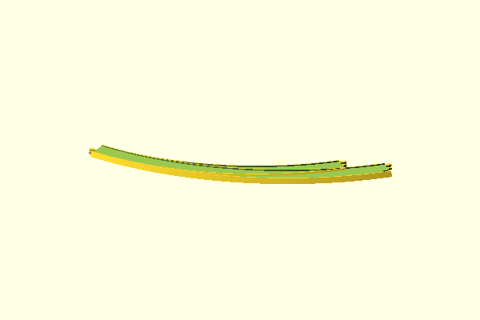
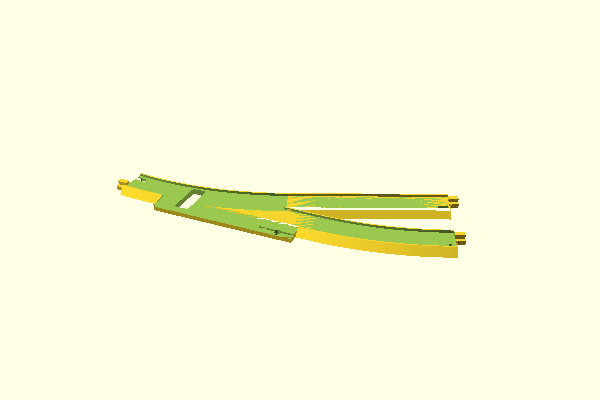
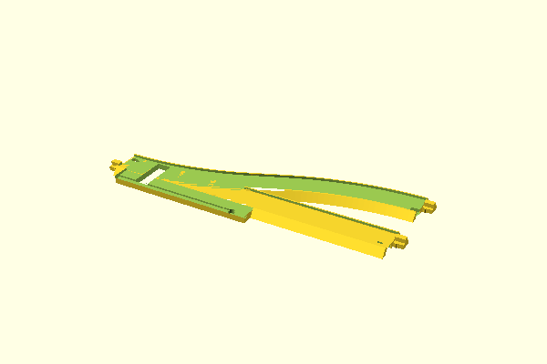
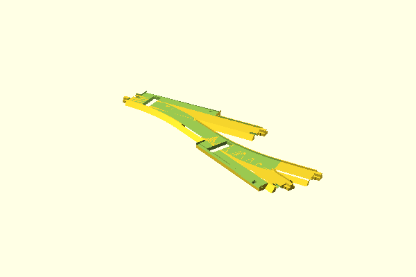

# Layout Overview

| Layout | Preview |
|--------|---------|
| [Curved Turnout Left](scad/curved-turnout-left.scad) |  |
| [Layout 2L — Turnout R + Curve R1 + Straight](scad/layout-2-l.scad) |  |
| [Layout 2R — Turnout R + S-Curve 24°](scad/layout-2-r.scad) |  |
| [Double Turnout Junction (R → L)](scad/layout.scad) |  |
